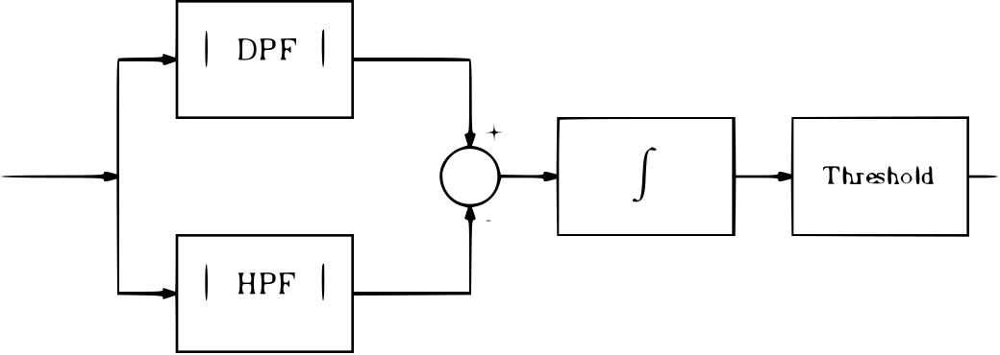
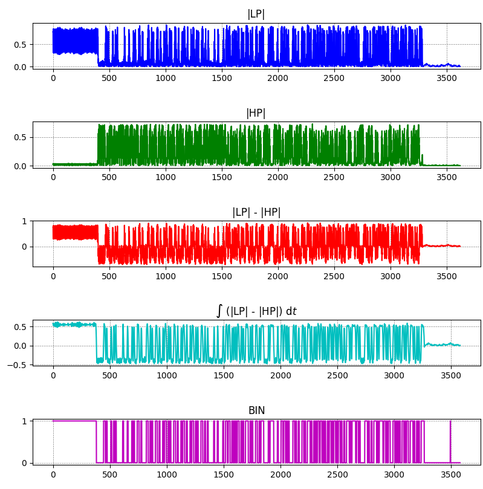
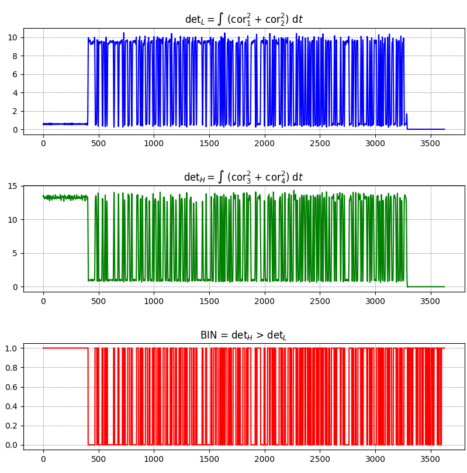
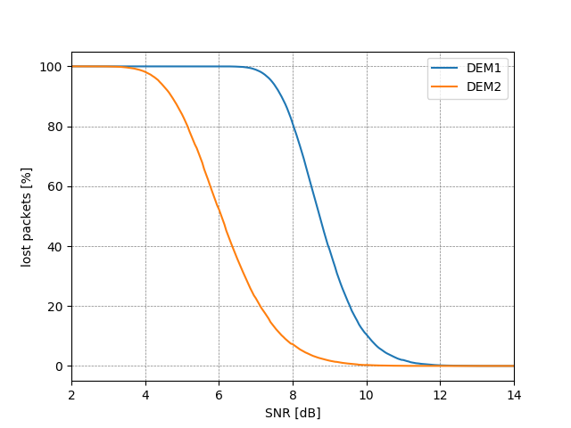

# MIKS-FSK

Tento proThis project simulates the FSK demodulator at a different signal-to-noise ratio of SNR after passing through the AWGN channel.

It uses the python multi-threaded library and allows for parallel simulation of multiple SNR values ​​at the endpoint.

For most calculations, a numpy and scipy library are used.

